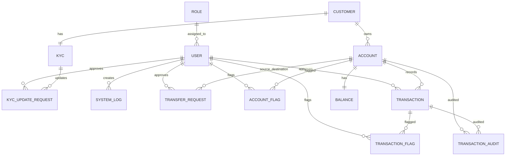

# This is dev branch
# Core Retail Ledger & Balance Mutation Engine
## Phase 1: Local Data Foundation & Enterprise Schema

This repository contains the local multi-datastore foundation and streaming architecture supporting the **Core Retail Ledger & Balance Mutation Engine**.

---

## 1. Quick Start for Team Members

### Prerequisites
- [Docker Desktop](https://www.docker.com/products/docker-desktop/) (v20.10+ with Compose v2) running on your machine.
- 4GB+ available RAM allocated to Docker.

### One-Click Bootstrap

#### On Windows (PowerShell):
```powershell
.\scripts\setup.ps1
```

#### On Linux / macOS (Bash):
```bash
chmod +x scripts/*.sh
./scripts/setup.sh
```

The script will automatically:
1. Copy `.env.example` to `.env` if not present.
2. Launch the 4 datastores, Kafka broker, and Kafka UI in detached mode.
3. Automatically execute all DDL schemas and seed data on initial container creation.
4. Run the full verification suite to validate database connectivity, table counts, invariant check constraints, and cryptographic triggers.

---

## 2. Infrastructure Inventory & Connection Matrix

| Service | Technology | Host Port | Database / PDB | Default User | Default Password | Purpose |
|---|---|:---:|---|---|---|---|
| **`oracle-core-db`** | Oracle Database Free / 21c XE | `1521` | `XEPDB1` | `core_user` | `CorePassword123!` | System of Record, Master Balances, Pessimistic Row Locking (`SELECT FOR UPDATE`) |
| **`postgres-audit-db`** | PostgreSQL 16 | `5432` | `audit_store` | `postgres` | `AuditPassword123!` | Immutable Forensic Audit Store, SHA-256 Hash Chained Journal, Read Query Path |
| **`redis-cache`** | Redis 7.4 Alpine | `6379` | `db 0` | *(none)* | *(none)* | Sub-2ms Distributed Idempotency Pre-flight Lock (`SETNX`) & Balance Read Cache |
| **`kafka-broker`** | Apache Kafka 3.8.0 (KRaft) | `9092` | *(broker)* | *(plaintext)* | *(none)* | Asynchronous Event Streaming Backbone (`ledger.mutation.completed.v1`) |
| **`kafka-ui`** | Provectus Kafka UI | `8085` | `local-cluster` | *(web)* | *(none)* | Visual browser dashboard for topics, messages, consumer groups |

---

## 3. Database Schemas & DDL Architecture

All 13 tables from the approved Capstone ERD are defined and initialized:



### Data Architecture & Single Source of Truth (SSOT)

To strictly adhere to enterprise banking standards and avoid data drift / split-brain hazards:
- **Oracle XE (`core_user` in `XEPDB1`)**: Serves as the **Exclusive Master System of Record (SoR)** holding all 13 core business and operational tables.
- **PostgreSQL (`audit_store`)**: Serves as the **Segregated Immutable Forensic Audit Store** holding exclusively `audit_store.ledger_mutation_audit`.

### Master Operational Tables (Oracle Exclusive)
1. **`ROLE`**: Administrative and operational permission roles (`ROLE_ADMIN`, `ROLE_TELLER`, `ROLE_CUSTOMER`).
2. **`USER`**: Internal bank personnel (tellers, compliance officers, managers).
3. **`CUSTOMER`**: Retail bank clients authenticated at the consumer edge.
4. **`KYC`**: Customer identification and verification profiles.
5. **`KYC_UPDATE_REQUEST`**: Workflow requests for customer data modifications requiring teller approval.
6. **`ACCOUNT`**: Deposit accounts (`SAVINGS`, `CHECKING`) with currency (PHP default) and status.
7. **`BALANCE`**: Authoritative available balance with strict check constraint (`available_balance >= 0`). Target for pessimistic locks.
8. **`TRANSFER_REQUEST`**: Dual-account fund transfer staging and approval records.
9. **`ACCOUNT_FLAG`**: Risk, judicial, or administrative holds on accounts.
10. **`TRANSACTION`**: Master journal entries capturing transaction type, amount, old balance, and new balance.
11. **`TRANSACTION_FLAG`**: Fraud / AML inspection flags on specific transaction events.
12. **`SYSTEM_LOG`**: Operational activity and microservice audit log.
13. **`TRANSACTION_AUDIT`**: Mirror audit ledger.

### Immutable Audit Store (PostgreSQL Exclusive)
- **`audit_store.ledger_mutation_audit`**:
  - Cryptographic SHA-256 hash chaining linking each mutation to the previous hash.
  - Database trigger throwing SQL exception `ERRCODE 55000` on any `UPDATE` or `DELETE` attempt.

---

## 4. Developer Runbook & Common Commands

### Verification & Health Check
Run at any time to verify system health and constraint integrity:
```powershell
.\scripts\verify.ps1
```

### Stopping & Starting
```powershell
# Stop without losing data:
.\scripts\stop.ps1

# Resume containers:
.\scripts\start.ps1
```

### Full Clean Reset
To completely wipe databases, Kafka logs, and Redis cache and re-initialize from scratch:
```powershell
.\scripts\reset.ps1
```

### Direct Database Access

#### Oracle SQLPlus CLI
```bash
docker exec -it oracle-core-db sqlplus core_user/CorePassword123!@localhost:1521/XEPDB1
```

#### PostgreSQL PSQL CLI
```bash
docker exec -it postgres-audit-db psql -U postgres -d audit_store
```

#### Redis CLI
```bash
docker exec -it redis-cache redis-cli
```

#### Kafka CLI (Produce & Consume)
```bash
# Consume ledger events:
docker exec -it kafka-broker /opt/kafka/bin/kafka-console-consumer.sh \
  --bootstrap-server localhost:9092 \
  --topic ledger.mutation.completed.v1 \
  --from-beginning
```

---

## 5. Spring Boot `application.yml` Connection Templates

When developing Spring Boot services in Phase 2 & 3:

```yaml
spring:
  # Oracle Master System of Record (Primary Datasource)
  datasource:
    oracle:
      url: jdbc:oracle:thin:@localhost:1521/XEPDB1
      username: core_user
      password: CorePassword123!
      driver-class-name: oracle.jdbc.OracleDriver
      hikari:
        maximum-pool-size: 30
        minimum-idle: 5

    # PostgreSQL Immutable Audit Store (Secondary Datasource)
    postgres:
      url: jdbc:postgresql://localhost:5432/audit_store
      username: postgres
      password: AuditPassword123!
      driver-class-name: org.postgresql.Driver
      hikari:
        maximum-pool-size: 20
        minimum-idle: 5

  # Redis Distributed Idempotency & Cache
  data:
    redis:
      host: localhost
      port: 6379

  # Kafka Event Streaming
  kafka:
    bootstrap-servers: localhost:9092
    producer:
      key-serializer: org.apache.kafka.common.serialization.StringSerializer
      value-serializer: org.springframework.kafka.support.serializer.JsonSerializer
```
