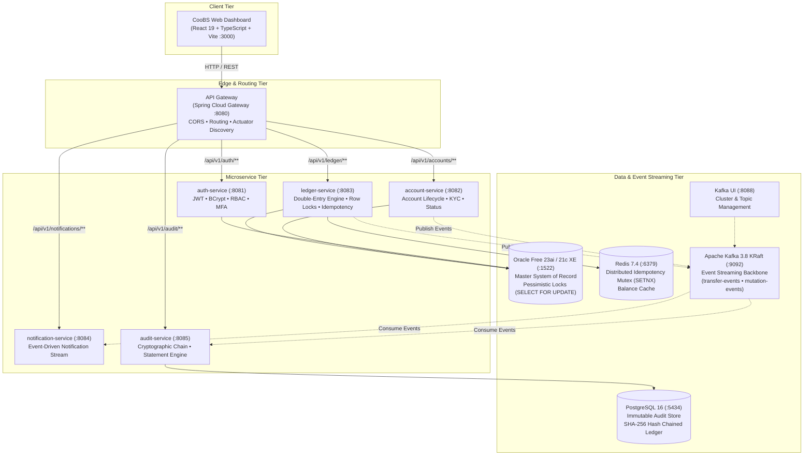

# CooBS Core Retail Banking Platform
### Enterprise Microservices Architecture & Double-Entry Balance Mutation Engine

CooBS is a cloud-native, enterprise-grade core banking platform engineered for high-concurrency retail financial operations. The system features a double-entry ledger with pessimistic row locking, sub-2ms distributed idempotency guards, event-driven streaming, and a segregated immutable forensic audit store secured by SHA-256 cryptographic hash chaining.

---

## 1. Architecture Overview

CooBS is built around a domain-driven microservices architecture fronted by a Spring Cloud API Gateway, supported by an enterprise polyglot data tier, and managed through a real-time React 19 operational dashboard.


```mermaid
flowchart TB
    subgraph Client Tier
        UI["CooBS Web Dashboard\n(React 19 + TypeScript + Vite :3000)"]
    end

    subgraph Edge & Routing Tier
        GW["API Gateway\n(Spring Cloud Gateway :8080)\nCORS • Routing • Actuator Discovery"]
    end

    subgraph Microservice Tier
        AUTH["auth-service (:8081)\nJWT • BCrypt • RBAC • MFA"]
        ACCT["account-service (:8082)\nAccount Lifecycle • KYC • Status"]
        LEDGER["ledger-service (:8083)\nDouble-Entry Engine • Row Locks • Idempotency"]
        NOTIF["notification-service (:8084)\nEvent-Driven Notification Stream"]
        AUDIT["audit-service (:8085)\nCryptographic Chain • Statement Engine"]
    end

    subgraph Data & Event Streaming Tier
        ORACLE[("Oracle Free 23ai / 21c XE (:1522)\nMaster System of Record\nPessimistic Locks (SELECT FOR UPDATE)")]
        POSTGRES[("PostgreSQL 16 (:5434)\nImmutable Audit Store\nSHA-256 Hash Chained Ledger")]
        REDIS[("Redis 7.4 (:6379)\nDistributed Idempotency Mutex (SETNX)\nBalance Cache")]
        KAFKA["Apache Kafka 3.8 KRaft (:9092)\nEvent Streaming Backbone\n(transfer-events • mutation-events)"]
        KAFKA_UI["Kafka UI (:8088)\nCluster & Topic Management"]
    end

    UI -->|HTTP / REST| GW
    GW -->|/api/v1/auth/**| AUTH
    GW -->|/api/v1/accounts/**| ACCT
    GW -->|/api/v1/ledger/**| LEDGER
    GW -->|/api/v1/notifications/**| NOTIF
    GW -->|/api/v1/audit/**| AUDIT

    AUTH --> ORACLE
    ACCT --> ORACLE
    ACCT -.->|Publish Events| KAFKA
    LEDGER --> ORACLE
    LEDGER --> REDIS
    LEDGER -.->|Publish Events| KAFKA
    KAFKA -.->|Consume Events| NOTIF
    KAFKA -.->|Consume Events| AUDIT
    AUDIT --> POSTGRES
    KAFKA_UI -.-> KAFKA
```

---

## 2. Infrastructure Inventory & Connection Matrix

| Service / Container | Technology | Host Port | Database / Schema | Auth / User | Purpose |
|---|---|:---:|---|---|---|
| **`api-gateway`** | Spring Cloud Gateway | `8080` | N/A | Bearer JWT | Central edge ingress, CORS filtering, path routing, Prometheus actuator metrics |
| **`auth-service`** | Spring Boot 3.x / Java 21 | `8081` | Oracle `XEPDB1` | Database Auth | Customer registration, staff/customer login, RSA/HMAC JWT tokens, MFA challenges |
| **`account-service`** | Spring Boot 3.x / Java 21 | `8082` | Oracle `XEPDB1` | Database Auth | Account opening, KYC lifecycle, closure requests, staff/customer account visibility |
| **`ledger-service`** | Spring Boot 3.x / Java 21 | `8083` | Oracle `XEPDB1` | Database Auth | Atomic double-entry fund transfers, balance mutations, pessimistic row locks |
| **`notification-service`** | Spring Boot 3.x / Java 21 | `8084` | In-Memory / Kafka | Database Auth | Kafka consumer for debit/credit alerts, in-app notification center |
| **`audit-service`** | Spring Boot 3.x / Java 21 | `8085` | PostgreSQL `audit_store` | Database Auth | Forensic audit consumer, SHA-256 cryptographic chain verification, statement queries |
| **`frontend`** | React 19 / TypeScript / Vite | `3000` | N/A | JWT Session | Real-time banking dashboard, persona switcher, transfer engine, audit chain verifier |
| **`oracle-core-db`** | Oracle Database Free | `1522` / `5501` | `XEPDB1` | `core_user` | Master System of Record (SoR), ACID transactions, table check constraints (`balance >= 0`) |
| **`postgres-audit-db`** | PostgreSQL 16 Alpine | `5434` | `audit_store` | `postgres` | Segregated immutable audit ledger, append-only trigger protection (`ERRCODE 55000`) |
| **`redis-cache`** | Redis 7.4 Alpine | `6379` | `db 0` | *(none)* | Sub-2ms distributed idempotency pre-flight locks (`SETNX`) & balance cache |
| **`kafka-broker`** | Apache Kafka 3.8 (KRaft) | `9092` | *(broker)* | *(plaintext)* | Enterprise event streaming backbone (`transfer-events`, `ledger.mutation.completed.v1`) |
| **`kafka-ui`** | Provectus Kafka UI | `8088` | `local-cluster` | *(web)* | Visual browser dashboard for topics, messages, offsets, and consumer groups |

---

## 3. Quick Start & Execution

### Prerequisites
- [Docker Desktop](https://www.docker.com/products/docker-desktop/) (v20.10+ with Compose v2) with 4GB+ RAM allocated.
- [Node.js](https://nodejs.org/) (v20+) for local UI development (optional if using Docker).
- [Java 21](https://adoptium.net/) & Maven (optional for standalone service development).

### Option A: Launch Complete Stack (All Microservices + Data Tier)
To launch all 6 Spring Boot microservices, the 4 datastores, Kafka, and Kafka UI in containers:

```bash
docker compose --profile app up -d --build
```

### Option B: Launch Data Tier Only (for Local IDE Debugging)
To launch only Oracle, PostgreSQL, Redis, Kafka, and Kafka UI:

```bash
docker compose up -d
```

### Accessing the Web Dashboard
Launch the frontend UI:
```bash
cd frontend
npm install
npm run preview   # Runs on port 3000 (pre-configured proxy to Gateway :8080)
```
Open **`http://localhost:3000`** in your browser.

---

## 4. Seeded Identities & Test Personas

All seed accounts are pre-configured in Oracle Database with default password **`Password123!`**:

| Persona | Role | Username | Password | Default Vault Accounts | Key Permissions |
|---|---|---|---|---|---|
| **Retail Customer 1** | `ROLE_CUSTOMER` | `john_doe` | `Password123!` | Account #1 (`ACC_10000001`)<br>Savings: **₱49,625.00** | View own accounts, submit transfers, request account closure |
| **Retail Customer 2** | `ROLE_CUSTOMER` | `maria_santos` | `Password123!` | Account #2 (`ACC_10000002`)<br>Checking: **₱25,375.00** | View own accounts, receive transfers, request account closure |
| **Retail Customer 3** | `ROLE_CUSTOMER` | `david_kim` | `Password123!` | Account #3 (`ACC_10000003`)<br>Savings: **₱100,000.00** | View own accounts, submit transfers |
| **Branch Teller** | `ROLE_TELLER` | `teller_alice` | `Password123!` | *Bank-wide operational scope* | **View all customer accounts**, process counter deposits, assisted transfers, KYC approvals |
| **Administrator** | `ROLE_ADMIN` | `admin` | `Password123!` | *Global supervisory scope* | **View all accounts**, approve account closures, full cryptographic audit inspection |

---

## 5. Core Architectural Differentiators

### A. Atomic Double-Entry Ledger Engine
Every fund transfer executes zero-sum accounting across debit and credit journal entries within a single database transaction. 
- Overdrafts are physically prevented at both the application layer and database engine level via Oracle table check constraints:
  ```sql
  CONSTRAINT chk_balance_non_negative CHECK (available_balance >= 0)
  ```

### B. Strict Concurrency & Pessimistic Row Locking
To eliminate lost updates and race conditions during high-frequency balance mutations, `ledger-service` executes deterministic account locking:
```sql
SELECT available_balance FROM BALANCE WHERE account_id = :id FOR UPDATE
```
Accounts are ordered by ID before acquisition to guarantee deadlock-free execution.

### C. Sub-2ms Distributed Idempotency Guard (Redis Mutex)
To protect against network retries and replay attacks, `ledger-service` enforces a multi-tier idempotency pipeline:
1. **Pre-flight Lock**: Redis atomic `SET key value NX EX 120` acquires a 120-second lease within 2ms.
2. **Payload Checksum**: Compares payload SHA-256 hash against previously executed requests.
3. **Cached Replay**: Duplicate submissions return the original transaction response (`X-Cache: HIT`) without debiting accounts twice.

### D. Segregated Cryptographic Audit Ledger (SHA-256)
Audit data is segregated from the operational database to guarantee non-repudiation:
- Events stream asynchronously through Kafka to `audit-service`.
- Saved in PostgreSQL `audit_store.ledger_mutation_audit` with cryptographic hash chaining:
  $$\text{Current Hash} = \text{SHA256}(\text{Previous Hash} + \text{Account ID} + \text{Txn ID} + \text{Type} + \text{Amount} + \text{New Balance} + \text{Timestamp})$$
- The table is locked with an append-only trigger that aborts `UPDATE` and `DELETE` queries with SQL code `ERRCODE 55000`.
- The UI features a real-time verification engine verifying hundreds of historical mutations in milliseconds.

---

## 6. End-to-End Automated Golden Path Demonstration

A comprehensive automated test suite validates the entire 7-tier architecture against the live API Gateway:

### Run in PowerShell:
```powershell
.\scripts\demo_golden_path.ps1
```

### Run in Python (Cross-Platform):
```bash
python ./scripts/demo_golden_path.py
```

### Verification Pipeline:
1. **API Gateway Health & Route Discovery**: Verifies `/actuator/health` and dynamic service routes.
2. **Customer Registration & JWT Provisioning**: Registers a new customer and acquires an HMAC-signed Bearer JWT.
3. **Account Lifecycle Inspection**: Verifies account retrieval through `account-service`.
4. **Atomic Double-Entry Fund Transfer**: Executes a ₱150.00 inter-account transfer through `ledger-service`.
5. **Idempotent Replay Mutex Guard**: Replays the exact transfer payload with the same `Idempotency-Key` and verifies zero duplicate balance deduction in under 15ms.
6. **In-App Notification Delivery**: Validates Kafka event consumption by `notification-service`.
7. **Forensic Cryptographic Audit Verification**: Executes `/api/v1/audit/verify-chain/1` to verify hundreds of SHA-256 chained audit records and confirms `isChainIntact: true`.

---

## 7. Postman Test Suite & Newman Automated Testing

A complete enterprise-grade Postman collection and environment suite is included in [`postman/`](file:///d:/Fullstack/Capstone-dev/postman):

- **Collection:** [`postman/CooBS_Core_Banking.postman_collection.json`](file:///d:/Fullstack/Capstone-dev/postman/CooBS_Core_Banking.postman_collection.json) (25 test cases across 6 folders)
- **Environment:** [`postman/CooBS_Local.postman_environment.json`](file:///d:/Fullstack/Capstone-dev/postman/CooBS_Local.postman_environment.json)
- **Comprehensive Guide:** [`docs/POSTMAN_TEST_SUITE_GUIDE.md`](file:///d:/Fullstack/Capstone-dev/docs/POSTMAN_TEST_SUITE_GUIDE.md)

### Running via Postman Desktop:
1. Import both JSON files into Postman.
2. Select the `CooBS Local (Docker Gateway)` environment.
3. Run the collection to verify all 25 assertions with real-time token capture and dynamic balance checks.

### Running via Newman CLI (Automated CI/CD):
```bash
newman run postman/CooBS_Core_Banking.postman_collection.json \
  -e postman/CooBS_Local.postman_environment.json \
  --delay-request 100
```

---

## 8. Enterprise Observability Tier (Prometheus & Grafana)

The platform includes a pre-configured, production-grade observability stack fulfilling **ADR-09 (Prometheus)** and **ADR-10 (Grafana)**:

- **Grafana Operational Command Center:** [`http://localhost:3001`](http://localhost:3001) (Pre-provisioned dashboard: *CooBS Core Banking — Operational Command Center*)
- **Prometheus Server & Metrics Console:** [`http://localhost:9090`](http://localhost:9090) (Scrapes all 6 Spring Boot microservices every 5 seconds)
- **Detailed Runbook & Metric Dictionary:** [`docs/ENTERPRISE_OBSERVABILITY_GUIDE.md`](file:///d:/Fullstack/Capstone-dev/docs/ENTERPRISE_OBSERVABILITY_GUIDE.md)

### Launching Observability Stack:
```powershell
# Start Prometheus and Grafana alongside existing core services
docker compose --profile observability up -d

# Verify container status
docker compose ps prometheus grafana
```

---

## 9. Developer Runbook & Direct Database Access

### Oracle SQLPlus CLI
```bash
docker exec -it oracle-core-db bash -c 'sqlplus "${APP_USER}/${APP_USER_PASSWORD}@localhost:1521/${ORACLE_DATABASE}"'
```

### PostgreSQL PSQL CLI
```bash
docker exec -it postgres-audit-db psql -U postgres -d audit_store
```

### Redis CLI
```bash
docker exec -it redis-cache redis-cli
```

### Kafka Event Consumer
```bash
docker exec -it kafka-broker /opt/kafka/bin/kafka-console-consumer.sh \
  --bootstrap-server localhost:9092 \
  --topic transfer-events \
  --from-beginning
```

### System Health & Diagnostics
```powershell
# Verify container health and port bindings
docker compose ps

# Inspect logs of a specific service
docker compose logs -f ledger-service
docker compose logs -f audit-service
```
