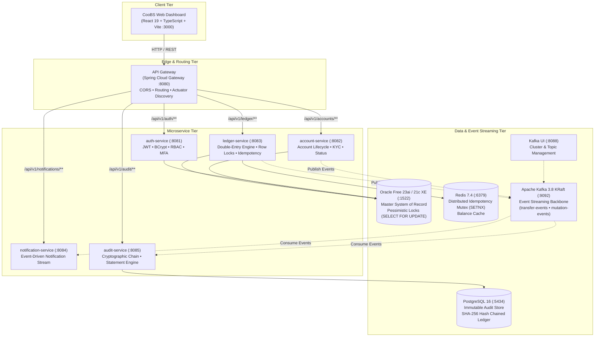

# CooBS Core Retail Banking Platform

### Enterprise Microservices Architecture & Double-Entry Balance Mutation Engine

CooBS is a cloud-native, enterprise-grade core banking platform engineered for high-concurrency retail financial operations. The system features a double-entry ledger with pessimistic row locking, sub-2ms distributed idempotency guards, event-driven streaming, and a segregated immutable forensic audit store secured by SHA-256 cryptographic hash chaining.

---

## 1. Architecture Overview

CooBS is built around a domain-driven microservices architecture fronted by a Spring Cloud API Gateway, supported by an enterprise polyglot data tier, and managed through a real-time React 19 operational dashboard.


```mermaid
flowchart TB
    subgraph Client Tier
        UI["CooBS Web Dashboard\n(React 19 + TypeScript + Vite :3000)"]
    end

    subgraph Edge & Routing Tier
        GW["API Gateway\n(Spring Cloud Gateway :8080)\nCORS • Routing • Actuator Discovery"]
    end

    subgraph Microservice Tier
        AUTH["auth-service (:8081)\nJWT • BCrypt • RBAC • MFA"]
        ACCT["account-service (:8082)\nAccount Lifecycle • KYC • Status"]
        LEDGER["ledger-service (:8083)\nDouble-Entry Engine • Row Locks • Idempotency"]
        NOTIF["notification-service (:8084)\nEvent-Driven Notification Stream"]
        AUDIT["audit-service (:8085)\nCryptographic Chain • Statement Engine"]
    end

    subgraph Data & Event Streaming Tier
        ORACLE[("Oracle Free 23ai / 21c XE (:1522)\nMaster System of Record\nPessimistic Locks (SELECT FOR UPDATE)")]
        POSTGRES[("PostgreSQL 16 (:5434)\nImmutable Audit Store\nSHA-256 Hash Chained Ledger")]
        REDIS[("Redis 7.4 (:6379)\nDistributed Idempotency Mutex (SETNX)\nBalance Cache")]
        KAFKA["Apache Kafka 3.8 KRaft (:9092)\nEvent Streaming Backbone\n(transfer-events • mutation-events)"]
        KAFKA_UI["Kafka UI (:8088)\nCluster & Topic Management"]
    end

    UI -->|HTTP / REST| GW
    GW -->|/api/v1/auth/**| AUTH
    GW -->|/api/v1/accounts/**| ACCT
    GW -->|/api/v1/ledger/**| LEDGER
    GW -->|/api/v1/notifications/**| NOTIF
    GW -->|/api/v1/audit/**| AUDIT

    AUTH --> ORACLE
    ACCT --> ORACLE
    ACCT -.->|Publish Events| KAFKA
    LEDGER --> ORACLE
    LEDGER --> REDIS
    LEDGER -.->|Publish Events| KAFKA
    KAFKA -.->|Consume Events| NOTIF
    KAFKA -.->|Consume Events| AUDIT
    AUDIT --> POSTGRES
    KAFKA_UI -.-> KAFKA
```

---

## 2. Infrastructure Inventory & Connection Matrix

| Service / Container        | Technology                   |    Host Port    | Database / Schema       | Auth / User   | Purpose                                                                                    |
| -------------------------- | ---------------------------- | :-------------: | ----------------------- | ------------- | ------------------------------------------------------------------------------------------ |
| **`api-gateway`**          | Spring Cloud Gateway         |     `8080`      | N/A                     | Bearer JWT    | Central edge ingress, CORS filtering, path routing, Prometheus actuator metrics            |
| **`auth-service`**         | Spring Boot 3.x / Java 21    |     `8081`      | Oracle`XEPDB1`          | Database Auth | Customer registration, staff/customer login, RSA/HMAC JWT tokens, MFA challenges           |
| **`account-service`**      | Spring Boot 3.x / Java 21    |     `8082`      | Oracle`XEPDB1`          | Database Auth | Account opening, KYC lifecycle, closure requests, staff/customer account visibility        |
| **`ledger-service`**       | Spring Boot 3.x / Java 21    |     `8083`      | Oracle`XEPDB1`          | Database Auth | Atomic double-entry fund transfers, balance mutations, pessimistic row locks               |
| **`notification-service`** | Spring Boot 3.x / Java 21    |     `8084`      | In-Memory / Kafka       | Database Auth | Kafka consumer for debit/credit alerts, in-app notification center                         |
| **`audit-service`**        | Spring Boot 3.x / Java 21    |     `8085`      | PostgreSQL`audit_store` | Database Auth | Forensic audit consumer, SHA-256 cryptographic chain verification, statement queries       |
| **`frontend`**             | React 19 / TypeScript / Vite |     `3000`      | N/A                     | JWT Session   | Real-time banking dashboard, persona switcher, transfer engine, audit chain verifier       |
| **`oracle-core-db`**       | Oracle Database Free         | `1522` / `5501` | `XEPDB1`                | `core_user`   | Master System of Record (SoR), ACID transactions, table check constraints (`balance >= 0`) |
| **`postgres-audit-db`**    | PostgreSQL 16 Alpine         |     `5434`      | `audit_store`           | `postgres`    | Segregated immutable audit ledger, append-only trigger protection (`ERRCODE 55000`)        |
| **`redis-cache`**          | Redis 7.4 Alpine             |     `6379`      | `db 0`                  | _(none)_      | Sub-2ms distributed idempotency pre-flight locks (`SETNX`) & balance cache                 |
| **`kafka-broker`**         | Apache Kafka 3.8 (KRaft)     |     `9092`      | _(broker)_              | _(plaintext)_ | Enterprise event streaming backbone (`transfer-events`, `ledger.mutation.completed.v1`)    |
| **`kafka-ui`**             | Provectus Kafka UI           |     `8088`      | `local-cluster`         | _(web)_       | Visual browser dashboard for topics, messages, offsets, and consumer groups                |
| **`prometheus`**           | Prometheus v2.50             |     `9090`      | `prometheus_data`       | _(none)_      | Time-series scraper (5s interval), alerts, PromQL metrics engine                            |
| **`grafana`**              | Grafana 10.3                 |     `3001`      | `grafana_data`          | Anonymous     | Unified command center with auto-provisioned SLA & Centralized Log dashboards               |
| **`loki`**                 | Grafana Loki 2.9             |     `3100`      | `loki_data`             | _(none)_      | Log aggregation engine with TSDB schema v13 and multi-tenant filesystem chunk storage       |
| **`promtail`**             | Grafana Promtail 2.9         |     `9080`      | N/A                     | Docker Socket | Container log collector with multiline Java stack trace aggregation & level tagging         |
| **`jaeger`**               | Jaeger All-in-One 1.57       | `16686` / `4318` | In-Memory               | _(none)_      | Distributed tracing UI and OpenTelemetry (OTLP) span collector                             |

---

## 3. Quick Start & Execution

### Prerequisites

- [Docker Desktop](https://www.docker.com/products/docker-desktop/) (v20.10+ with Compose v2) with 4GB+ RAM allocated.
- [Node.js](https://nodejs.org/) (v20+) for local UI development (optional if using Docker).
- [Java 21](https://adoptium.net/) & Maven (optional for standalone service development).

### Option A: Launch Complete Stack (All Microservices + Data Tier)

To launch all 6 Spring Boot microservices, the 4 datastores, Kafka, and Kafka UI in containers:

```bash
docker compose --profile app up -d --build
```

### Option B: Launch Data Tier Only (for Local IDE Debugging)

To launch only Oracle, PostgreSQL, Redis, Kafka, and Kafka UI:

```bash
docker compose up -d
```

### Accessing the Web Dashboard

Launch the frontend UI:

```bash
cd frontend
npm install
npm run preview   # Runs on port 3000 (pre-configured proxy to Gateway :8080)
```

Open **`http://localhost:3000`** in your browser.

---

## 4. Seeded Identities & Test Personas

All seed accounts are pre-configured in Oracle Database with default password **`Password123!`**:

| Persona               | Role            | Username       | Password       | Default Vault Accounts                             | Key Permissions                                                                             |
| --------------------- | --------------- | -------------- | -------------- | -------------------------------------------------- | ------------------------------------------------------------------------------------------- |
| **Retail Customer 1** | `ROLE_CUSTOMER` | `john_doe`     | `Password123!` | Account#1 (`ACC_10000001`)Savings: **₱49,625.00**  | View own accounts, submit transfers, request account closure                                |
| **Retail Customer 2** | `ROLE_CUSTOMER` | `maria_santos` | `Password123!` | Account#2 (`ACC_10000002`)Checking: **₱25,375.00** | View own accounts, receive transfers, request account closure                               |
| **Retail Customer 3** | `ROLE_CUSTOMER` | `david_kim`    | `Password123!` | Account#3 (`ACC_10000003`)Savings: **₱100,000.00** | View own accounts, submit transfers                                                         |
| **Branch Teller**     | `ROLE_TELLER`   | `teller_alice` | `Password123!` | _Bank-wide operational scope_                      | **View all customer accounts**, process counter deposits, assisted transfers, KYC approvals |
| **Administrator**     | `ROLE_ADMIN`    | `admin`        | `Password123!` | _Global supervisory scope_                         | **View all accounts**, approve account closures, full cryptographic audit inspection        |

---

## 5. Core Architectural Differentiators

### A. Atomic Double-Entry Ledger Engine

Every fund transfer executes zero-sum accounting across debit and credit journal entries within a single database transaction.

- Overdrafts are physically prevented at both the application layer and database engine level via Oracle table check constraints:
  ```sql
  CONSTRAINT chk_balance_non_negative CHECK (available_balance >= 0)
  ```

### B. Strict Concurrency & Pessimistic Row Locking

To eliminate lost updates and race conditions during high-frequency balance mutations, `ledger-service` executes deterministic account locking:

```sql
SELECT available_balance FROM BALANCE WHERE account_id = :id FOR UPDATE
```

Accounts are ordered by ID before acquisition to guarantee deadlock-free execution.

### C. Sub-2ms Distributed Idempotency Guard (Redis Mutex)

To protect against network retries and replay attacks, `ledger-service` enforces a multi-tier idempotency pipeline:

1. **Pre-flight Lock**: Redis atomic `SET key value NX EX 120` acquires a 120-second lease within 2ms.
2. **Payload Checksum**: Compares payload SHA-256 hash against previously executed requests.
3. **Cached Replay**: Duplicate submissions return the original transaction response (`X-Cache: HIT`) without debiting accounts twice.

### D. Segregated Cryptographic Audit Ledger (SHA-256)

Audit data is segregated from the operational database to guarantee non-repudiation:

- Events stream asynchronously through Kafka to `audit-service`.
- Saved in PostgreSQL `audit_store.ledger_mutation_audit` with cryptographic hash chaining:
  $$
  \text{Current Hash} = \text{SHA256}(\text{Previous Hash} + \text{Account ID} + \text{Txn ID} + \text{Type} + \text{Amount} + \text{New Balance} + \text{Timestamp})
  $$
- The table is locked with an append-only trigger that aborts `UPDATE` and `DELETE` queries with SQL code `ERRCODE 55000`.
- The UI features a real-time verification engine verifying hundreds of historical mutations in milliseconds.

---

## 6. End-to-End Automated Golden Path Demonstration

A comprehensive automated test suite validates the entire 7-tier architecture against the live API Gateway:

### Run in PowerShell:

```powershell
.\scripts\demo_golden_path.ps1
```

### Run in Python (Cross-Platform):

```bash
python ./scripts/demo_golden_path.py
```

### Verification Pipeline:

1. **API Gateway Health & Route Discovery**: Verifies `/actuator/health` and dynamic service routes.
2. **Customer Registration & JWT Provisioning**: Registers a new customer and acquires an HMAC-signed Bearer JWT.
3. **Account Lifecycle Inspection**: Verifies account retrieval through `account-service`.
4. **Atomic Double-Entry Fund Transfer**: Executes a ₱150.00 inter-account transfer through `ledger-service`.
5. **Idempotent Replay Mutex Guard**: Replays the exact transfer payload with the same `Idempotency-Key` and verifies zero duplicate balance deduction in under 15ms.
6. **In-App Notification Delivery**: Validates Kafka event consumption by `notification-service`.
7. **Forensic Cryptographic Audit Verification**: Executes `/api/v1/audit/verify-chain/1` to verify hundreds of SHA-256 chained audit records and confirms `isChainIntact: true`.

---

## 7. Automated Test Suites & Postman Collections

The repository provides two test execution methods for validating platform reliability, business invariants, security controls, and lifecycle transitions: **native PowerShell CLI runners** (no external npm dependencies required) and **Postman Collections (via Postman Desktop or Newman CLI)**.

### Available Test Suites & What They Do

| Test Suite                  | PowerShell Script                                                                          | Postman Collection JSON                                                                                                              | Key Validations & Invariants Covered                                                                                                                                                                                                                                                                                                                                                                                                                                                                                                                                                                                                                                                                                                                                                                                                                                                                                                                                                            |
| :-------------------------- | :----------------------------------------------------------------------------------------- | :----------------------------------------------------------------------------------------------------------------------------------- | :---------------------------------------------------------------------------------------------------------------------------------------------------------------------------------------------------------------------------------------------------------------------------------------------------------------------------------------------------------------------------------------------------------------------------------------------------------------------------------------------------------------------------------------------------------------------------------------------------------------------------------------------------------------------------------------------------------------------------------------------------------------------------------------------------------------------------------------------------------------------------------------------------------------------------------------------------------------------------------------------- |
| **CooBS Core Banking API**  | [`scripts/test_api_endpoints.ps1`](scripts/test_api_endpoints.ps1)                         | [`postman/CooBS_Core_Banking.postman_collection.json`](postman/CooBS_Core_Banking.postman_collection.json)                           | **13-Point Platform Operational Health & Transfer Flow**:• Gateway health check (`/actuator/health`) and dynamic route discovery.• Customer & Staff (Admin/Teller) JWT token authentication and claim extraction.• Account discovery & Redis-cached balance lookups.• Atomic double-entry transfer execution with balance mutation.• Sub-2ms Redis mutex idempotency replay verification.• Overdraft invariant guard (`HTTP 422 INSUFFICIENT_FUNDS`).• Kafka event-driven notification dispatch & consumption.• PostgreSQL audit statement retrieval and SHA-256 cryptographic chain verification.                                                                                                                                                                                                                                                                                                                                                                                              |
| **User Lifecycle Flow**     | [`scripts/test_user_lifecycle_flow.ps1`](scripts/test_user_lifecycle_flow.ps1)             | [`postman/User_Lifecycle_Flow.postman_collection.json`](postman/User_Lifecycle_Flow.postman_collection.json)                         | **8-Stage End-to-End Customer Lifecycle Journey**:1. Register brand-new customer with dynamic credentials.2. Customer login and JWT bearer acquisition.3. Customer submits initial KYC identity verification.4. Teller login (`teller_alice`) & savings account provisioning.5. Customer submits KYC change/update request.6. Admin login (`admin`) & approval of KYC update.7. Customer submits account closure request.8. Admin approves account closure & transitions status to `CLOSED`.                                                                                                                                                                                                                                                                                                                                                                                                                                                                                                    |
| **Edge Cases & Compliance** | [`scripts/test_edge_cases_and_compliance.ps1`](scripts/test_edge_cases_and_compliance.ps1) | [`postman/CooBS_Edge_Cases_And_Compliance.postman_collection.json`](postman/CooBS_Edge_Cases_And_Compliance.postman_collection.json) | **14 Negative-Testing, Invariant Guard & Rejection Workflows**:• **RBAC Security Guard**: Customers attempting to access staff endpoints are blocked (`HTTP 403 Forbidden`).• **Token Blacklist**: Token revocation (`POST /token/revoke`) and immediate reuse blocked via Redis (`HTTP 401 Unauthorized`).• **Transfer Invariants**: Self-transfer rejected (`HTTP 400`), missing `Idempotency-Key` rejected (`HTTP 400`), non-positive/zero amount rejected (`HTTP 400`), non-existent account rejected (`HTTP 404`).• **Compliance Guard**: Non-zero balance account closure rejected (`HTTP 400`).• **Account Status Controls**: Freezing and unfreezing accounts (`FROZEN` <-> `ACTIVE`).• **Risk Controls**: Imposing risk flags/holds on accounts and lifting them.• **Administrative Rejections**: KYC update request rejected (`REJECTED`) and account closure rejected (`REJECTED`) with audit reasons.• **Notification State**: Marking in-app notification as read (`PATCH /read`). |
| **Kafka Event-Driven Verification**   | [`scripts/test_kafka_events.ps1`](scripts/test_kafka_events.ps1)                           | [`postman/CooBS_Kafka_Event_Driven_Verification.postman_collection.json`](postman/CooBS_Kafka_Event_Driven_Verification.postman_collection.json) | **15-Step Event-Driven Notification Verification Flow**:<br>• **Successful Transfer Pipeline**: `ledger-service` emits `ledger.transfer.completed.v1` -> `notification-service` generates dual alerts: sender ("Funds Transfer Sent") & recipient ("Funds Transfer Received").<br>• **Failed Transfer Pipeline**: Overdraft / insufficient funds emits `ledger.transfer.failed.v1` -> sender alerted ("Funds Transfer Failed") with failure reason.<br>• **KYC Submission**: Customer submits KYC update emitting `kyc.request.submitted.v1` -> customer notified ("KYC Update Submitted").<br>• **KYC Approval**: Staff approves request emitting `kyc.request.evaluated.v1` -> customer notified ("KYC Update Approved").<br>• **KYC Rejection**: Staff rejects request emitting `kyc.request.evaluated.v1` -> customer notified ("KYC Update Rejected").<br>• **Direct Verification**: Automatically queries `/api/v1/notifications/my-notifications` to verify that Kafka asynchronous delivery succeeded end-to-end without requiring manual UI monitoring. |

---

### Running via PowerShell

You can execute each test suite individually or run all three consecutively from the workspace root in PowerShell:

#### 1. CooBS Core Banking API Test Suite:

```powershell
powershell -ExecutionPolicy Bypass -File scripts/test_api_endpoints.ps1
```

#### 2. User Lifecycle Flow Test Suite:

```powershell
powershell -ExecutionPolicy Bypass -File scripts/test_user_lifecycle_flow.ps1
```

#### 3. Edge Cases & Compliance Guard Test Suite:

```powershell
powershell -ExecutionPolicy Bypass -File scripts/test_edge_cases_and_compliance.ps1
```

#### 4. Kafka Event-Driven Verification Test Suite:

```powershell
powershell -ExecutionPolicy Bypass -File scripts/test_kafka_events.ps1
```

#### Run All 4 Suites Sequentially:

```powershell
powershell -ExecutionPolicy Bypass -Command "& 'scripts/test_api_endpoints.ps1'; & 'scripts/test_user_lifecycle_flow.ps1'; & 'scripts/test_edge_cases_and_compliance.ps1'; & 'scripts/test_kafka_events.ps1'"
```

_(Note: Pass `-GatewayUrl http://<host>:<port>` if targeting an environment other than default `http://localhost:8080`.)_

---

### Running via Newman CLI (Automated CI/CD)

All Postman collections use the shared environment [`postman/CooBS_Local.postman_environment.json`](postman/CooBS_Local.postman_environment.json):

```bash
# 1. CooBS Core Banking
newman run postman/CooBS_Core_Banking.postman_collection.json \
  -e postman/CooBS_Local.postman_environment.json \
  --delay-request 100

# 2. User Lifecycle Flow
newman run postman/User_Lifecycle_Flow.postman_collection.json \
  -e postman/CooBS_Local.postman_environment.json \
  --delay-request 100

# 3. CooBS Edge Cases & Compliance
newman run postman/CooBS_Edge_Cases_And_Compliance.postman_collection.json \
  -e postman/CooBS_Local.postman_environment.json \
  --delay-request 100

# 4. Kafka Event-Driven Verification
newman run postman/CooBS_Kafka_Event_Driven_Verification.postman_collection.json \
  -e postman/CooBS_Local.postman_environment.json \
  --delay-request 100
```

### Running via Postman Desktop:

1. Import the desired collection JSON files from [`postman/`](postman) into Postman.
2. Import the environment file [`postman/CooBS_Local.postman_environment.json`](postman/CooBS_Local.postman_environment.json).
3. Select the `CooBS Local (Docker Gateway)` environment in Postman.
4. Execute via the Collection Runner.

---

### Visualizing Kafka Events in Real-Time (Kafka UI)

While the automated test suites assert Kafka event delivery directly by querying `/api/v1/notifications/my-notifications`, you can also observe live messages flowing through the cluster in **Kafka UI**:

1. Open **`http://localhost:8088`** in your browser.
2. Select the **`local-cluster`** dashboard.
3. In the left navigation, click **Topics**:
   - `ledger.transfer.completed.v1`: Successful fund transfers.
   - `ledger.transfer.failed.v1`: Failed/rejected transfers with reason strings.
   - `kyc.request.submitted.v1`: Customer KYC update requests.
   - `kyc.request.evaluated.v1`: Staff approval or rejection decisions.
4. Click on any topic and select the **Messages** tab to view real-time JSON payloads, headers, partition keys (`customerId` / `sourceAccountId`), and timestamps.

---

### Performance & High-Concurrency Load Testing (Apache JMeter)

The platform includes an automated Apache JMeter performance testing suite ([`test/jmeter-load-test.jmx`](test/jmeter-load-test.jmx)) simulating continuous retail banking traffic against the Edge API Gateway.

#### Features & Architectural Safeguards:
- **Dynamic JWT Acquisition**: Virtual users authenticate via `POST /api/v1/auth/customers/login` and dynamically extract Bearer tokens.
- **Safe Closed-Loop "Ping-Pong" Balance Equilibrium**: Symmetrically alternates transfers between Account 1 and Account 2 (1.00 PHP nominal amount) to prevent balance exhaustion during high concurrency.
- **Traffic Composition**: 40% Account Portfolio Inquiries, 30% Real-Time Balance Queries, 20% Double-Entry Transfers (Ping-Pong), 10% Notification Feeds.
- **Gateway Rate-Limiter Pacing**: Uses Gaussian random timers (200–400ms delay) to stay aligned with Redis token bucket rate limiters.
- **SLA Assertions**: Automated response code checks (`200 OK`, `201 Created`) and response time assertions (< 3000 ms).

#### Running the Load Test:

```powershell
# 1. Automated Headless Runner (Default: 5 virtual users, 60s execution):
.\scripts\run_jmeter_test.ps1

# 2. Custom load test with automatic HTML report launch:
.\scripts\run_jmeter_test.ps1 -Threads 10 -Duration 120 -Report

# 3. Interactive JMeter GUI mode:
.\scripts\run_jmeter_test.ps1 -Gui
```

#### Native JMeter CLI:
```bash
jmeter -n -t test/jmeter-load-test.jmx \
  -l test/results/results.jtl \
  -e -o test/results/html-report \
  -JTHREADS=5 -JDURATION=60 -JSLA_MS=3000
```
Interactive HTML dashboard reports are generated under `test/results/html-report/index.html`. For full details, see [`test/README.md`](test/README.md).

---

## 8. Enterprise Observability Tier (Prometheus, Grafana, Loki & Promtail)

The platform includes a pre-configured, production-grade observability stack fulfilling **ADR-09 (Prometheus)**, **ADR-10 (Grafana)**, **ADR-11 (Distributed Tracing)**, and centralized container log aggregation:

- **Grafana Operational Command Center:** [`http://localhost:3001`](http://localhost:3001)
  - Dashboard 1: _CooBS Core Banking — Operational Command Center_ (Real-time TPS, P99 Latency SLA, HikariCP pools, JVM metrics)
  - Dashboard 2: _CooBS Core Banking — Centralized Log Stream & Error Inspector_ (Loki real-time log streaming, log velocity, error tracking, and domain feeds)
- **Prometheus Server & Metrics Console:** [`http://localhost:9090`](http://localhost:9090) (Scrapes all 6 Spring Boot microservices every 5 seconds)
- **Loki Log Engine & Promtail:** [`http://localhost:3100`](http://localhost:3100) (Ingests all container logs via Docker socket with multiline Java stack trace grouping)
- **Jaeger Distributed Tracing:** [`http://localhost:16686`](http://localhost:16686) (Visualizes inter-service request waterfall and latencies)
- **Detailed Runbook & Metric/Log Dictionary:** [`docs/docs-services/ENTERPRISE_OBSERVABILITY_GUIDE.md`](file:///d:/Fullstack/Capstone-dev/docs/docs-services/ENTERPRISE_OBSERVABILITY_GUIDE.md)

### Launching Observability Stack:

```powershell
# Start Prometheus, Grafana, Loki, and Promtail alongside core services
docker compose --profile app --profile observability up -d

# Verify container status
docker compose ps prometheus grafana loki promtail jaeger
```

---

## 9. Developer Runbook & Direct Database Access

### Oracle SQLPlus CLI

```bash
docker exec -it oracle-core-db bash -c 'sqlplus "${APP_USER}/${APP_USER_PASSWORD}@localhost:1521/${ORACLE_DATABASE}"'
```

### PostgreSQL PSQL CLI

```bash
docker exec -it postgres-audit-db psql -U postgres -d audit_store
```

### Redis CLI

```bash
docker exec -it redis-cache redis-cli
```

### Kafka Event Consumer

```bash
docker exec -it kafka-broker /opt/kafka/bin/kafka-console-consumer.sh \
  --bootstrap-server localhost:9092 \
  --topic transfer-events \
  --from-beginning
```

### System Health & Diagnostics

```powershell
# Verify container health and port bindings
docker compose ps

# Inspect logs of a specific service
docker compose logs -f ledger-service
docker compose logs -f audit-service
```
