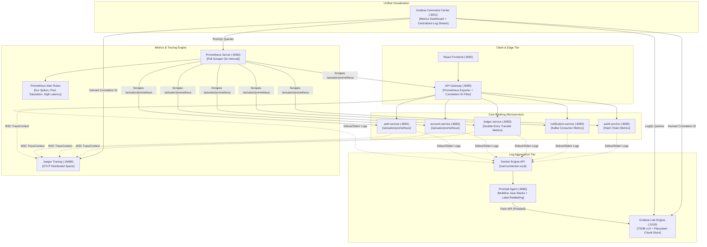

# CooBS Core Retail Banking Platform — Enterprise Observability Guide

This guide details the architecture, configuration, metric & log dictionary, and operational runbook for the **CooBS Enterprise Observability Tier**, fulfilling **ADR-09 (Prometheus)**, **ADR-10 (Grafana)**, **ADR-11 (Distributed Tracing / Jaeger)**, and the **Loki/Promtail Centralized Logging Specification** as specified in the [Architecture Defense Dossier](file:///d:/Fullstack/Capstone-dev/docs/ENTERPRISE_ARCHITECTURE_DEFENSE_DOSSIER.md).

---

## 1. Observability Architecture Overview

The Observability Tier provides unified three-pillar telemetry (**Metrics**, **Logs**, and **Traces**) across all 5 core banking microservices, the API Gateway, data persistence layers, and messaging backbones.



---

## 2. Service Endpoints & Quick Access Matrix

| Service | Port | Endpoint / Web UI | Credentials | Telemetry Type & Purpose |
| :--- | :---: | :--- | :--- | :--- |
| **Grafana Command Center** | `3001` | [`http://localhost:3001`](http://localhost:3001) | Anonymous (Viewer) or `admin` / `admin` | Unified visual NOC command center for metrics, alerts, and log streams |
| **Prometheus Server** | `9090` | [`http://localhost:9090`](http://localhost:9090) | None | Time-series scraper, targets monitor & PromQL console |
| **Loki Log Engine** | `3100` | [`http://localhost:3100`](http://localhost:3100) (`/ready`) | None | Multi-tenant log indexer, TSDB chunk storage, and LogQL search engine |
| **Promtail Scraper** | `9080` | [`http://localhost:9080/targets`](http://localhost:9080/targets) | None | Docker socket container log harvester & metadata tagger |
| **Jaeger Tracing UI** | `16686` | [`http://localhost:16686`](http://localhost:16686) | None | Distributed span trace waterfall visualizer (OTLP `:4317`/`:4318`) |
| **Kafka UI** | `8088` | [`http://localhost:8088`](http://localhost:8088) | None | Message payload viewer for financial event streams |
| **API Gateway Metrics** | `8080` | `http://localhost:8080/actuator/prometheus` | None | Edge ingress request rate, routing latency, rate limit tokens |
| **Auth Service Metrics** | `8081` | `http://localhost:8081/actuator/prometheus` | None | JWT auth throughput, refresh rate, login latency |
| **Account Service Metrics** | `8082` | `http://localhost:8082/actuator/prometheus` | None | Account lifecycle operations & KYC evaluation rates |
| **Ledger Service Metrics** | `8083` | `http://localhost:8083/actuator/prometheus` | None | Double-entry transfer throughput, lock waits, idempotency cache hits |
| **Notification Service Metrics** | `8084` | `http://localhost:8084/actuator/prometheus` | None | Kafka consumer lag & in-app alert dispatch throughput |
| **Audit Service Metrics** | `8085` | `http://localhost:8085/actuator/prometheus` | None | SHA-256 cryptographic chain verification throughput & statement generation |

---

## 3. Core Banking Metric Dictionary (PromQL)

### A. Executive & SLA Metrics
* **Microservice Availability:** `sum(up{job!="prometheus"})` (Target: 6/6 services active).
* **Global Transactions Per Second (TPS):** `sum(rate(http_server_requests_seconds_count[1m]))`
* **P99 Latency SLA Boundary:** `histogram_quantile(0.99, sum(rate(http_server_requests_seconds_bucket[1m])) by (le)) * 1000` (Target: $< 200\text{ms}$).
* **HTTP 5xx Error Rate Percentage:** `(sum(rate(http_server_requests_seconds_count{status=~"5.."}[1m])) or vector(0)) / (sum(rate(http_server_requests_seconds_count[1m])) or vector(1)) * 100` (Alert threshold: $> 5\%$).

### B. Double-Entry Ledger Domain Metrics
* `banking_transfers_attempted_total`: Cumulative counter of transfer requests initiated.
* `banking_transfers_completed_total{status="SUCCESS"}`: Cumulative counter of atomic double-entry fund transfers successfully finalized.
* `banking_transfers_failed_total{exception="..."}`: Counter of rejected transactions categorized by root cause (`InsufficientFundsException`, `InvalidTransactionException`, `OptimisticLockingFailureException`).

### C. Database Connection Pool Saturation (HikariCP)
* `hikaricp_connections_active`: Active connections currently executing SQL queries against Oracle or PostgreSQL.
* `hikaricp_connections_idle`: Idle connections ready in the pool.
* `(hikaricp_connections_active / (hikaricp_connections_idle + hikaricp_connections_active)) * 100`: Pool saturation percentage (Alert threshold: $> 90\%$).

### D. JVM Telemetry
* `jvm_memory_used_bytes{area="heap"}`: Heap memory consumption across microservice containers.
* `jvm_gc_pause_seconds_max`: Maximum stop-the-world Garbage Collection pause duration.

---

## 4. Centralized Logging Tier (Loki & Promtail)

### A. Architecture & Log Harvesting
Log collection is fully decoupled from the Java application codebase:
1. **Container Capture:** Microservices write standard structured log events to `STDOUT`/`STDERR`.
2. **Promtail Daemon:** Promtail connects directly to `/var/run/docker.sock`, automatically discovering all 15 project containers.
3. **Multiline Parsing:** Promtail groups Java stack traces starting with ISO-8601 dates (`^\d{4}-\d{2}-\d{2}`) so multi-line exceptions are ingested as single searchable log blocks.
4. **Dynamic Labeling:** Enriches log records with `service`, `container`, `project`, and extracted log `level` (`INFO`, `WARN`, `ERROR`, `DEBUG`).
5. **Storage:** Loki indexes labels and compresses log chunks into local filesystem storage backed by persistent Docker volume `loki_data`.

### B. Promtail Configuration Highlights (`monitoring/promtail/promtail-config.yaml`)
```yaml
scrape_configs:
  - job_name: docker
    docker_sd_configs:
      - host: unix:///var/run/docker.sock
        refresh_interval: 5s
    relabel_configs:
      - source_labels: ['__meta_docker_container_name']
        regex: '/(.*)'
        target_label: 'container'
      - source_labels: ['__meta_docker_container_label_com_docker_compose_service']
        target_label: 'service'
      - source_labels: ['__meta_docker_container_label_com_docker_compose_project']
        target_label: 'project'
    pipeline_stages:
      - multiline:
          firstline: '^\d{4}-\d{2}-\d{2}'
          max_wait_time: 2s
          max_lines: 250
      - regex:
          expression: '(?P<level>INFO|WARN|DEBUG|ERROR)'
      - labels:
          level:
```

### C. Essential LogQL Query Dictionary
Open Grafana Explore ([http://localhost:3001/explore](http://localhost:3001/explore)) and select **Loki**:

| Operational Query | LogQL Expression |
| :--- | :--- |
| **All Service Logs** | `{container=~".+", service=~".+"}` |
| **Filter by Specific Service** | `{service="ledger-service"}` |
| **Errors & Exceptions Only** | `{level="ERROR"}` or `{container=~".+"} \|~ "(?i)exception\|error"` |
| **Cross-Service Trace by Correlation ID** | `{container=~".+"} \|~ "c00b5001-beef-4000-8000-000000000001"` |
| **Ledger Transfers with Structured Extraction** | `{service="ledger-service"} \|~ "Atomic transfer completed" \| regexp "src=(?P<src>\\d+).+dst=(?P<dst>\\d+).+amount=(?P<amount>[\\d.]+)"` |
| **Idempotency Duplicate Replays** | `{service="ledger-service"} \|~ "Idempotent replay"` |
| **Cryptographic Hash Chain Verifications** | `{service="audit-service"} \|~ "Cryptographic chain verified"` |
| **Log Ingestion Velocity (Lines/sec)** | `sum by (service) (rate({container=~".+", service=~".+"}[1m]))` |
| **Error Rate Velocity (Errors/sec)** | `sum by (service) (rate({container=~".+", level="ERROR"}[1m]))` |

---

## 5. Grafana Auto-Provisioned Dashboards

The platform provisions two operational dashboards out-of-the-box from [`monitoring/grafana/dashboards/`](file:///d:/Fullstack/Capstone-dev/monitoring/grafana/dashboards):

### 1. Operational Command Center (`coobs_core_banking.json`)
- **UID:** `coobs-banking-command-center` | **Folder:** `Core Banking`
- **Focus:** Real-time metrics, SLAs, TPS, latency distributions, JVM telemetry, and HikariCP connection pools.
- **Panels:**
  - Active Microservices Counter (Gauge 6/6)
  - Global Ingress TPS & Transfer Throughput (Time-series)
  - P50, P90, P99 Latency Heatmaps (ms)
  - HTTP 5xx Error Rate Percentage (%)
  - HikariCP Active vs. Idle Pool Connections
  - JVM Heap Memory & GC Pauses

### 2. Centralized Log Stream & Error Inspector (`coobs_centralized_logs.json`)
- **UID:** `coobs-centralized-logs` | **Folder:** `Core Banking`
- **Focus:** Centralized log stream, error velocity, regex text searching, and domain feeds.
- **Panels:**
  - **Log Ingestion Velocity by Service:** Live throughput (cps) across all 15 project containers.
  - **Error Rate Velocity by Service:** Real-time exception detector highlighting failing components.
  - **Total Errors Counter:** Cumulative count of error events in the selected time range.
  - **Live Unified Searchable Log Stream:** Real-time interactive log console with dropdown service filters (`$service`) and regex search (`$search`).
  - **Domain-Specific Feeds:** Pre-filtered live monitors for **Core Ledger & Transfers**, **Security, Auth & Sessions**, and **Forensic Audit & Hash Verifications**.

---

## 6. Prometheus Alerting Rules

Alert rules are defined in [`monitoring/prometheus/alerts.yml`](file:///d:/Fullstack/Capstone-dev/monitoring/prometheus/alerts.yml):

```yaml
groups:
  - name: coobs_banking_alerts
    rules:
      - alert: ServiceDown
        expr: up == 0
        for: 30s
        labels:
          severity: critical

      - alert: HighHttp5xxRate
        expr: sum(rate(http_server_requests_seconds_count{status=~"5.."}[1m])) / sum(rate(http_server_requests_seconds_count[1m])) * 100 > 5
        for: 1m
        labels:
          severity: critical

      - alert: SlowTransferLatencyP99
        expr: histogram_quantile(0.99, sum(rate(http_server_requests_seconds_bucket{uri=~"/api/v1/ledger/.*"}[1m])) by (le)) > 0.5
        for: 1m
        labels:
          severity: warning

      - alert: HikariConnectionPoolSaturation
        expr: (hikaricp_connections_active / (hikaricp_connections_idle + hikaricp_connections_active)) > 0.90
        for: 1m
        labels:
          severity: warning
```

---

## 7. Distributed Rate Limiting & Throttling Telemetry

CooBS protects core banking microservices against denial-of-service (DoS) and credential brute-force attacks via **Redis Token Bucket Rate Limiting** at the Edge API Gateway (`api-gateway`).

### Active Rate Limit Policies:
| Route Tier | Predicate | Key Resolver | Replenish Rate | Burst Capacity | Defense Purpose |
| :--- | :--- | :--- | :---: | :---: | :--- |
| **Authentication** | `/api/v1/auth/**` | `ipKeyResolver` | **10 req/s** | **20** | Brute force / credential stuffing protection |
| **Financial Ledger** | `/api/v1/ledger/**` | `userOrIpKeyResolver` | **20 req/s** | **40** | High-frequency mutation & DB lock protection |
| **Account Lifecycle** | `/api/v1/accounts/**` | `userOrIpKeyResolver` | **50 req/s** | **100** | Standard customer/account operations |
| **Audit Queries** | `/api/v1/audit/**` | `userOrIpKeyResolver` | **30 req/s** | **60** | Cryptographic verification workload protection |
| **Notifications** | `/api/v1/notifications/**` | `userOrIpKeyResolver` | **50 req/s** | **100** | Notification stream & feed polling |

### Response Headers Emitted:
When a request is processed by the Gateway, the following telemetry headers are included:
- `X-Correlation-ID`: Trace UUID matching across gateway, microservices, and audit logs.
- `X-RateLimit-Remaining`: Tokens remaining in client's token bucket for the current 1-second replenishment window.
- `X-RateLimit-Burst-Capacity`: Maximum burst allowed.
- `X-RateLimit-Replenish-Rate`: Sustainable request replenishment rate per second.

When client exceeds burst capacity, Gateway returns **`HTTP 429 Too Many Requests`** with `X-RateLimit-Remaining: 0`.

### Monitoring Throttled Requests in Prometheus / Grafana:
```promql
sum(rate(http_server_requests_seconds_count{status="429"}[1m])) by (uri)
```

---

## 8. Operational Runbook: Managing the Stack

### Launch Complete Observability Tier:
```powershell
docker compose --profile app --profile observability up -d
```

### Launch Observability Only (Metrics + Logs + Traces):
```powershell
docker compose --profile observability up -d
```

### Restart Logging Agents in Place:
```powershell
docker restart grafana loki promtail
```

### Verify Status of All Monitoring Containers:
```powershell
docker compose ps prometheus grafana loki promtail jaeger
```
All containers should display `Up` or `Up (healthy)`.
